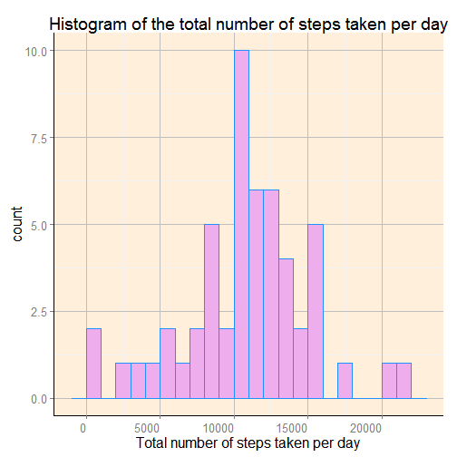
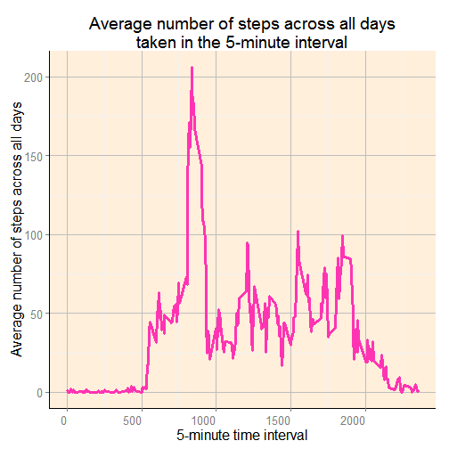
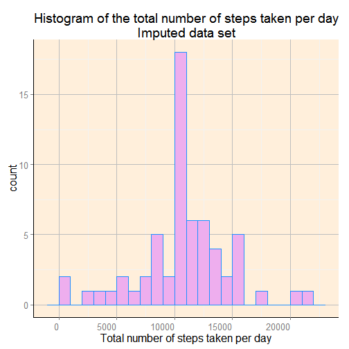
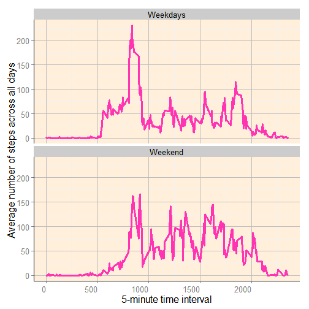

### Basic settings
```{r}
echo = TRUE  # Always make code visible
```

### Loading and processing the data
```{r}
# installing/loading the package data.table:
if(!require(data.table)) {
  install.packages("data.table"); require(data.table)} #load / install+load data.table

# installing/loading the package ggplot2:
if(!require(ggplot2)) {
  install.packages("ggplot2"); require(ggplot2)} #load / install+load ggplot2

# Make nicer background theme in ggplot
science_theme <- theme(panel.grid.major = element_line(size = 0.5, color = "grey"),panel.background = element_rect(fill="antiquewhite1"), 
                       axis.line = element_line(size = 0.7, color = "black"), text = element_text(size = 16),
                       axis.text.x = element_text(angle = 0, hjust = 1))

# Read the data from the folder
activity_data <- read.csv("D:/datasciencecoursera1/RepResData assignment1/activity.csv")

# Convert the data.frame to data.table for easier manipulation
activity_data <- data.table(activity_data)

# Convert "date" column to Date format (instead of factor)
activity_data$date <- as.Date(activity_data$date, format = "%Y-%m-%d")
```
### What is mean total number of steps taken per day?
For this part of the assignment, you can ignore the missing values in the dataset.

First I will calculate the total number of steps taken each day using the functionality of the data.table package

```{r}
# Calculate the total number of steps taken per day
steps_per_day <-  activity_data[,list(dailysteps = sum(steps, na.rm = TRUE)), by = "date"]
```

* Make a histogram of the total number of steps taken each day

Due to missing values in some days, the aggregation on the daily level using the functionality of the data.table package resulted in some zero values which should be excluded from the further analysis since they represent that we do not have a value on that day
```{r histraw}
# Plot the histogram of the total number of steps taken each day
ggplot(steps_per_day[which(steps_per_day$dailysteps != 0)], aes(x=dailysteps)) + geom_histogram(colour = "dodgerblue", fill = "plum2", binwidth = 1000) + science_theme +
  labs(title = "Histogram of the total number of steps taken per day") + xlab("Total number of steps taken per day")
```

 

* Calculate and report the mean and median total number of steps taken per day

Mean total number of steps taken per day:
```{r}
# Mean of the total number of steps taken per day
mean_steps_per_day <- mean(steps_per_day$dailysteps[which(steps_per_day$dailysteps != 0)])
mean_steps_per_day
```
Median total number of steps taken per day:
```{r}
# Median of the total number of steps taken per day
median_steps_per_day <- median(steps_per_day$dailysteps[which(steps_per_day$dailysteps != 0)])
median_steps_per_day
```

### What is the average daily activity pattern?
* Make a time series plot (i.e. type = "l") of the 5-minute interval (x-axis) and the average number of steps taken, averaged across all days (y-axis)

```{r tsraw}
# Calculate the average number of steps taken in the 5-minute interval averaged across all days
steps_per_interval <-  activity_data[,list(intervalsteps = mean(steps, na.rm = T)), by = "interval"]

# Plot the average number of steps taken in the 5-minute interval averaged across all days
ggplot(steps_per_interval, aes(x = interval, y = intervalsteps)) + 
  geom_line(group = 1, size = 1.15, color = "maroon1") +
  science_theme + ylab("Average number of steps across all days") + xlab("5-minute time interval") + 
  labs(title = "Average number of steps across all days\ntaken in the 5-minute interval")
```

 

* Which 5-minute interval, on average across all the days in the dataset, contains the maximum number of steps?
```{r}
# Calculate which 5-minute interval contains the maximum number of steps
max_interval <- steps_per_interval$interval[which.max(steps_per_interval$intervalsteps)]
max_interval
```

### Imputing missing values
* The total number of rows with NAs:

```{r}
# Calculate the total number of missing values
activity_NA <- nrow(activity_data[!complete.cases(activity_data),])
activity_NA
```

* Devise a strategy for filling in all of the missing values in the dataset. The strategy does not need to be sophisticated. For example, you could use the mean/median for that day, or the mean for that 5-minute interval, etc.

I used the mean for that 5-minute interval to fill each NA value in the steps column.

* Create a new dataset that is equal to the original dataset but with the missing data filled in.

```{r}
# activity_data_imputed is the imputed data set with the same length as the original data set but it doesn't contain missing values
activity_data_imputed <- activity_data
idx1 <- which(is.na(activity_data_imputed))
activity_data_imputed$steps <- as.double(activity_data_imputed$steps)
for (i in 1:nrow(steps_per_interval)){
  if (length(which(activity_data_imputed[idx1]$interval == steps_per_interval$interval[i])) > 0){
    
    idx <- which(activity_data_imputed[idx1]$interval == steps_per_interval$interval[i])
    activity_data_imputed[idx1]$steps[idx] <- steps_per_interval$intervalsteps[i]
  }
}

head(activity_data_imputed)
nrow(activity_data_imputed[!complete.cases(activity_data_imputed),])
```

* Make a histogram of the total number of steps taken each day and Calculate and report the mean and median total number of steps taken per day. 

Total number of steps taken per day for the imputed data set:
```{r}
# Calculate the total number of steps taken per day for the imputed data set
steps_per_day_imputed <-  activity_data_imputed[,list(dailysteps = sum(steps)), by = "date"]
```

```{r histimp}
# Plot the histogram of the total number of steps taken each day for the imputed data set
ggplot(steps_per_day_imputed, aes(x=dailysteps)) + geom_histogram(colour = "dodgerblue", fill = "plum2", binwidth = 1000) + science_theme +
  labs(title = "Histogram of the total number of steps taken per day\nImputed data set") + xlab("Total number of steps taken per day")
```

 

Mean total number of steps taken per day:
```{r}
# Mean of the total number of steps taken per day for the imputed data set
mean_steps_per_day_imputed <- mean(steps_per_day_imputed$dailysteps)
mean_steps_per_day_imputed
```

Median total number of steps taken per day:
```{r}
# Median of the total number of steps taken per day for the imputed data set
median_steps_per_day_imputed <- median(steps_per_day_imputed$dailysteps)
median_steps_per_day_imputed
```

* Do these values differ from the estimates from the first part of the assignment? What is the impact of imputing missing data on the estimates of the total daily number of steps?

```{r}
raw <- data.frame(median_steps_per_day, mean_steps_per_day)
colnames(raw) <- c("Median", "Mean")
imputed <- data.frame(median_steps_per_day_imputed, mean_steps_per_day_imputed)
colnames(imputed) <- c("Median", "Mean")
resulted_matrix <- rbind(raw, imputed)
rownames(resulted_matrix) <- c("Raw data", "Imputed data")
knitr::kable(resulted_matrix)

```

As we can see from the table above, the mean remained the same while the median is larger in the imputed data set than in the raw one. Actually, the median sifted towards the mean, and more specifically, the mean and the median in the imputed data set are identical.

### Are there differences in activity patterns between weekdays and weekends?

* Create a new factor variable in the dataset with two levels -- "weekday" and "weekend" indicating whether a given date is a weekday or weekend day.

To answer this question I used the imputed data set.

```{r}
# Create the factor variable for weekend and weekdays
# First extract information about the specific day using the function "weekdays" and store it in a variable in the data set called "weekday"
activity_data_imputed$weekday <- weekdays(activity_data_imputed$date)

# Using the ifelse vectorized version create the factor variable for weekend and weekdays
activity_data_imputed$weekday_factor <- factor(ifelse(activity_data_imputed$weekday == "Saturday" | activity_data_imputed$weekday == "Sunday", "Weekend", "Weekdays"))

head(activity_data_imputed)
```

* Make a panel plot containing a time series plot (i.e. type = "l") of the 5-minute interval (x-axis) and the average number of steps taken, averaged across all weekday days or weekend days (y-axis).

```{r tsimp}
# Calculate the average number of steps taken in the 5-minute interval averaged across all days
steps_per_interval_imputed <-  activity_data_imputed[,list(intervalsteps = mean(steps)), by = c("interval", "weekday_factor")]

# Panel plot of the 5-minute interval and the average number of steps taken, averaged across all weekday days or weekend days
ggplot(steps_per_interval_imputed, aes(x = interval, y = intervalsteps)) + 
  geom_line(group = 1, size = 1.15, color = "maroon1") +
  facet_wrap(~ weekday_factor, ncol=1) + 
  science_theme + ylab("Average number of steps across all days") + xlab("5-minute time interval")
```


